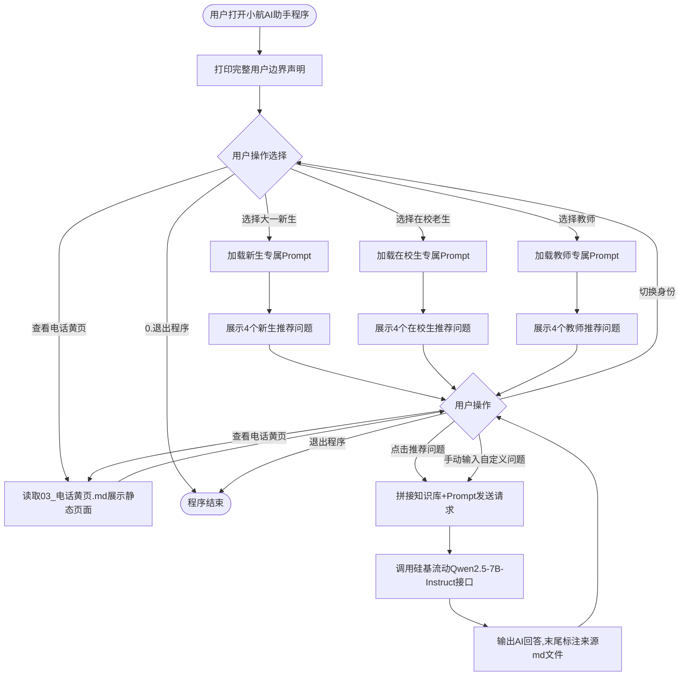

# 功能模块设计与流程图设计
## 一、4个P0功能模块清单表格
| 模块分类 | 功能编号 | 功能名称 | 功能描述 | 优先级 |
|--------|---------|---------|---------|--------|
| 校园问答 | P0-1 | 校园知识库问答 | 用户输入文字问题，程序读取4份本地md校园知识库，拼接对应身份Prompt调用硅基流动API生成回答，回答末尾标注信息来源md文件名 | P0（核心必做） |
| 身份分流 | P0-2 | 用户身份选择切换 | 程序启动后首页提供身份选择：大一新生/在校老生/教师；选中身份自动加载对应专属System Prompt，区分回答语气与输出侧重点 | P0（必做） |
| 快捷引导 | P0-3 | 身份对应推荐问题按钮 | 根据用户选中身份，展示4个该身份高频问题，点击即可一键发送提问，无需手动输入文字，降低新手使用门槛 | P0（必做） |
| 兜底保障 | P0-4 | 静态电话黄页页面 | 独立功能分支，直接读取`data/03_电话黄页.md`纯文本展示，**不调用AI接口**，网络异常、API额度耗尽时作为兜底查询渠道 | P0（必做） |

## 二、首页边界声明完整文本
```text
============================
        小航 · 郑州航院校园信息查询 AI 助手
   知识库数据最新更新日期：2026-07-15
============================
 我能提供咨询服务：
  1. 大一新生报到相关：报到流程、宿舍配置、学费缴纳、军训安排、校园反诈
  2. 在校生校内办事：学籍证明、校园卡补办、转专业、图书馆开放时间
  3. 教师教学行政事务：差旅报销、调课申请、教室设备报修、科研申报
  4. 校园应急联络：各部门办公电话、24小时校园110、心理援助热线

 我无法提供以下服务：
  1. 查询个人隐私数据：成绩、课表、校园卡余额、个人档案信息
  2. 接入校内教务/财务/一卡通后台系统
  3. 校外娱乐闲聊、法律咨询、医疗诊断、投资理财等无关咨询
  4. 替用户做决策、代写完整作业论文、生成虚假证明材料

补充说明：文档内学费、时间、办公电话如有变动，全部以郑州航院官方线下通知为准，标注⚠的信息务必二次核实。
============================
请选择操作：
1. 大一新生
2. 在校老生
3. 教师
4. 查看静态电话黄页（无需AI接口）
0. 退出程序
```

## 三、应用主流程文字说明
1. 用户启动小航AI助手程序；
2. 程序首页输出完整用户边界声明，告知用户服务范围与限制；
3. 用户进行操作选择：可选三种用户身份，或直接查看电话黄页静态页面；
4. 若选择身份（新生/在校生/教师）：自动加载对应身份专属Prompt，展示该身份4条推荐快捷问题；
5. 用户可选择两种提问方式：点击推荐问题一键发送、手动输入自定义问题；也可随时切换身份回到选择页面；
6. 程序读取本地4份md知识库文件，拼接身份Prompt与用户问题，调用硅基流动API获取AI回复；
7. 页面展示AI回答内容，并在末尾标注信息来源md文件；
8. 用户可重复提问、切换身份，或随时跳转至电话黄页页面；
9. 若用户选择查看电话黄页：直接读取黄页md文件展示全部联系电话，不发起任何AI接口请求，网络异常也可正常查看；
10. 用户输入0可退出程序。

## 四、Mermaid流程图代码


## 五、小组讨论记录（2个核心问题答案）
### 问题1：电话黄页为什么是P0核心必做功能？
1. 存在API不可用风险：网络中断、接口额度耗尽、服务器故障时，AI问答功能完全失效；
2. 电话是最低成本兜底解决方案，用户可以直接联系校内官方部门人工咨询；
3. 黄页独立存储为md文件，无需依赖大模型接口，本地可直接读取展示，稳定性极强；
4. 师生应急场景（财物丢失、设备故障、心理危机）需要立刻获取联络方式，不能依赖AI。

### 问题2：为什么不开发用户登录功能？
1. 项目技术约束：仅使用Prompt+API+本地md文件，不引入数据库、账号存储模块；
2. 隐私安全风险：收集师生账号、密码、个人信息会产生信息泄露隐患；
3. 项目定位为轻量化演示工具，无需区分个人用户数据，无保存用户历史记录需求；
4. 大一认知实习阶段核心学习Prompt工程与API调用，登录系统属于额外复杂功能，超出课程学习范围。