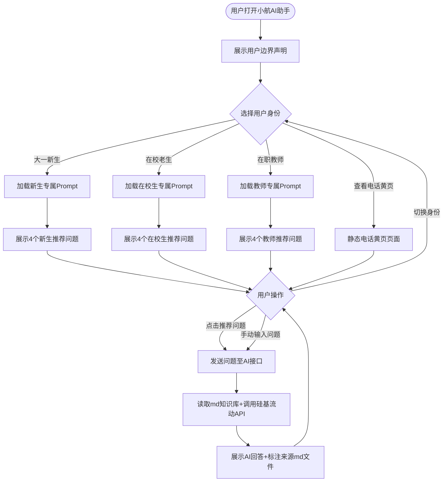

# "小航"校园信息查询 AI 助手 - 项目需求分析文档（第24组）
> 课程：郑州航空工业管理学院 人工智能专业大一认知实习 · 第5天
> 日期：2026-07-14
> 用途：小组需求分析正式文档
> 文件名：需求分析文档-第24组.md
---
## 一、项目概述
**项目名称：** 小航--郑州航院校园信息查询 AI 助手

**项目目标：** 为郑州航院三类用户（大一新生、在校老生、教师）提供校园专属信息查询服务，覆盖新生报到、校内办事、校园联络、安全应急四大核心场景。依托 Prompt 工程 + 大模型 API 调用实现问答能力，仅使用 Markdown 文件存储知识库，不引入数据库、RAG、向量库等复杂技术。

**技术栈：**

| 技术环节 | 选型 | 说明 |
|---------|------|------|
| 核心技术 1 | Prompt 工程 | 三套身份分流Prompt + 7组别名词典 + 6条防幻觉硬规则 |
| 核心技术 2 | 硅基流动 API 调用 | Qwen/Qwen2.5-7B-Instruct 模型，Python requests 库请求 |
| 数据存储 | Markdown 文件 | 4份独立md知识库，AI直接读取内容作为回答依据 |
| 开发语言 | Python | 基于前序课程所学基础语法开发 |
**小组成员：** XXX、XXX、XXX、XXX（第3组）
---
## 二、用户分析
本项目面向三类用户，使用优先级：大一新生 > 在校老生 > 在职教师。
### 2.1 大一新生（优先级：高）
| 项目 | 内容 |
|------|------|
| 用户特点 | 不熟悉校园环境、各类流程不了解、易遭受电信/校园诈骗、不清楚校内职能部门 |
| 高频需求 | 报到流程、宿舍配置、缴费方式、军训安排、校园防骗 |
| 使用优先级 | 高——开学季集中使用，信息需求最迫切 |
**高频问题（4个）：**
1. 新生报到完整流程是什么，需要带哪些材料？
2. 学费、住宿费线上缴费渠道有哪些？
3. 学校宿舍是几人间，有没有独立卫浴？
4. 收到冒充辅导员收费的消息该怎么处理？

### 2.2 在校老生（优先级：中）
| 项目 | 内容 |
|------|------|
| 用户特点 | 熟悉基础校园环境，侧重各类办事流程，追求高效简洁答案 |
| 高频需求 | 学籍证明办理、校园卡挂失补办、转专业流程、图书馆开放时间 |
| 使用优先级 | 中——日常办事持续有需求，无集中爆发期 |
**高频问题（4个）：**
1. 线上线下怎么开具在校学籍证明？
2. 校园一卡通丢失补办流程和地点在哪？
3. 大一大二转专业申请时间和条件是什么？
4. 图书馆工作日、周末开闭馆时间？

### 2.3 教师（优先级：中）
| 项目 | 内容 |
|------|------|
| 用户特点 | 聚焦教学、行政、科研工作，需要官方政策、对接部门、联系人信息 |
| 高频需求 | 差旅报销流程、调课手续、教室设备报修、科研项目申报渠道 |
| 使用优先级 | 中——使用频次低，但信息准确性要求极高 |
**高频问题（4个）：**
1. 教师出差差旅报销需要准备哪些票据？
2. 临时调课、停课该走什么申请流程？
3. 教室多媒体设备故障联系哪个部门维修？
4. 校级、省级科研项目申报通知在哪里查看？
---
## 三、功能需求
| 功能编号 | 功能名称 | 功能描述 | 优先级 | 设计理由 |
|---------|---------|---------|--------|---------|
| P0-1 | 校园知识库问答 | 用户输入文字问题，AI读取4份md知识库内容作答，回答末尾标注信息来源文件 | P0 | 产品核心价值功能，实现校园信息智能查询，是所有功能的基础 |
| P0-2 | 身份切换分流 | 进入系统后选择身份（新生/在校生/教师），自动加载对应专属Prompt，区分回答语气与侧重点 | P0 | 三类用户需求场景完全不同，统一回答无法精准匹配需求，分流后提升回答针对性 |
| P0-3 | 一键推荐问题 | 根据选中身份展示对应4个高频问题按钮，点击可直接发送提问，无需手动输入文字 | P0 | 降低用户使用门槛，解决部分用户不知道该问什么的问题，提升产品易用性 |
| P0-4 | 静态电话黄页页面 | 独立页面展示校内各部门、应急联系电话，无需调用AI接口，网络异常时兜底可用 | P0 | 保障极端场景下基础联络信息可查看，避免API故障导致完全无法使用 |

> P1/P2 暂不开发：个人成绩查询、课表查询、账号登录、数据可视化。大一阶段优先完成全部P0功能，保证基础业务闭环。
---
## 四、应用流程
### 4.1 主流程文字说明
用户打开小航程序 → 展示完整用户边界声明 → 选择自身用户身份 → 页面展示对应身份4条推荐问题 → 用户可手动输入问题或点击推荐按钮发送请求 → 程序加载对应身份Prompt读取md知识库 → 调用硅基流动API生成回答 → 输出回答并标注来源文件；页面支持切换身份、重复提问；电话黄页为独立分支，不依赖AI接口。

### 4.2 Mermaid流程图

---
## 五、数据设计
### 5.1 存储格式选型对比
| 格式 | 是否采用 | 选择理由 |
|------|---------|------|
| JSON | 否 | 手动编写繁琐，符号容错低，不适合团队维护 |
| CSV | 否 | 仅支持扁平表格，无法分级存放多场景文字信息 |
| Markdown | **是** | 书写简单、层级清晰、AI可直接读取，无需额外解析工具 |

### 5.2 4份核心MD文件清单
| 文件名 | 内容主题 | 适用用户 |
|--------|---------|------------|
| data/01_新生入学指南.md | 报到材料、宿舍、缴费、军训、新生须知 | 大一新生（优先） |
| data/02_校内办事流程.md | 学籍证明、补卡、转专业、调课、设备报修 | 在校生、教师 |
| data/03_校园电话黄页.md | 各行政部门、后勤、保卫、心理咨询联系方式 | 全体用户 |
| data/04_校园安全应急.md | 反诈提醒、校园110、心理援助、突发事件处理 | 全体用户 |

### 5.3 5条统一写作规范
1. 每份md文件头部标注维护人、最新更新日期、信息官方来源；
2. 使用二级标题`##`划分不同业务模块，结构清晰；
3. 涉及金额、时间、办公地点、联系电话，末尾标注⚠信息以学校官方最新通知为准；
4. 暂时未核验的政策、流程信息统一标注✏待核实，不随意填充内容；
5. 单份文档字数控制在1500-3000字，四份知识库总字数约1万字。
---
## 六、Prompt 设计
### 6.1 三套身份分流Prompt（角色、语气、回答重点）
1. **大一新生身份Prompt**
你是热心负责的大二学长，专门解答郑州航院新生所有问题。回答语言口语化、详细易懂，多给出实操提醒，重点讲清完整流程，主动提醒校园反诈相关内容，用词温和有耐心。
2. **在校老生身份Prompt**
你是熟悉校内办事流程的在校学长，回答简洁精炼，只输出地点、所需材料、办理时间、对接部门等关键信息，不添加多余无关话术。
3. **教师身份Prompt**
你是面向郑航教职工的专业办公助手，回答正式严谨，优先给出政策依据、办事窗口、对接负责人、申报截止时间，条理清晰，符合行政办公规范。

### 6.2 7组校园别名词典
| 日常口语别名 | 标准统一名称 |
|---------|---------|
| 航院、郑航、ZUA、本校 | 郑州航空工业管理学院 |
| 龙湖校区、新校区 | 龙子湖主校区 |
| 饭卡、校卡、一卡通 | 校园一卡通 |
| 校警、门卫、安保 | 保卫处 |
| 迁户口、落户学校 | 学生户籍迁入/迁出手续 |
| 换宿舍、调寝室 | 宿舍调整申请 |
| 在校证明、学籍单 | 在校学籍证明 |

### 6.3 6条防幻觉硬规则（三套Prompt强制包含）
1. 所有回答只能依据4份md知识库内容，无对应资料时明确告知：“暂无相关收录信息，建议拨打学校总机0371-61911000咨询官方”；
2. 禁止编造、修改任何电话号码、办公地址、学费金额、教师姓名、办事时间；
3. 但凡涉及转账、缴费、收费类问题，必须附带反诈提示：所有线上转账务必先联系辅导员核实，陌生收费均为诈骗；
4. 用户提及心理危机、轻生等负面情绪，统一输出学校心理咨询中心联系方式+心理援助热线，并提醒第一时间告知辅导员；
5. 拒绝查询用户个人成绩、课表、一卡通余额等隐私数据，明确说明系统不接入校内教务、财务系统；
6. 每一段AI回答末尾必须标注信息来源`[来源：xxx.md]`，保证内容可追溯。
---
## 七、用户边界声明
```text
============================
        小航 · 郑航校园信息查询 AI 助手
   数据最新更新日期：2026-07-14
============================
✅ 我能聊的内容：
  1. 大一新生报到相关：流程、宿舍、缴费、军训、入学须知
  2. 全校办事流程：在校生学籍业务、教师教学行政手续
  3. 校内各部门联系电话、应急联络黄页
  4. 校园反诈、心理援助、突发事件安全指引

❌ 我不能聊/不提供的服务：
  1. 无法查询个人成绩、课表、校园卡余额、个人隐私信息
  2. 不接入校内教务、财务、一卡通后台系统
  3. 不替用户做决策、不提供校外无关咨询、不闲聊娱乐话题

补充说明：文档内金额、时间、地点如有变动，均以学校官方线下通知为准。
============================
```
**边界声明三要素核对**
| 要素 | 对应内容 |
|------|------|
| 能聊范围 | 新生报到、校内办事、电话黄页、安全应急四大场景咨询 |
| 不能聊范围 | 个人隐私数据查询、校外闲聊、代替用户决策、接入校内业务系统 |
| 数据更新日期 | 2026-07-14 |
---
## 八、不做的事（至少5项，每项附带理由）
| 不做的功能/技术 | 详细理由 |
|---------|------|
| 不开发向量库、RAG检索技术 | 大一认知实习阶段学习基础API调用与Prompt工程，复杂检索框架超出当前学习范围，增加开发难度 |
| 不使用LangChain等大模型开发框架 | 仅依靠Python requests库即可完成接口请求，轻量化实现，减少第三方依赖，降低排错成本 |
| 不搭建MySQL/Excel数据库存储数据 | 需求规定仅使用Markdown文件作为知识库，无需额外数据库部署，降低项目复杂度 |
| 不实现用户注册、登录、账号存储功能 | 不采集师生个人账号、密码等隐私数据，规避信息泄露安全风险，简化开发流程 |
| 不做云端部署、线上网页发布 | 项目仅要求本地Python程序运行演示，无需服务器、域名、部署运维相关开发工作 |
| 不开发图片识别、文档上传解析功能 | 项目定位纯文本问答工具，多媒体解析非核心需求，额外增加模型调用成本与开发工作量 |
---
## 附：12个推荐问题明细（三类用户各4个）
### 大一新生推荐问题
1. 新生报到完整流程是什么，需要带哪些材料？
2. 学费、住宿费线上缴费渠道有哪些？
3. 学校宿舍是几人间，有没有独立卫浴？
4. 收到冒充辅导员收费的消息该怎么处理？

### 在校老生推荐问题
1. 线上线下怎么开具在校学籍证明？
2. 校园一卡通丢失补办流程和地点在哪？
3. 大一大二转专业申请时间和条件是什么？
4. 图书馆工作日、周末开闭馆时间？

### 教师推荐问题
1. 教师出差差旅报销需要准备哪些票据？
2. 临时调课、停课该走什么申请流程？
3. 教室多媒体设备故障联系哪个部门维修？
4. 校级、省级科研项目申报通知在哪里查看？

## 附：API 固定配置
| 配置项 | 固定参数值 |
|--------|-----|
| API服务商 | 硅基流动 SiliconFlow |
| 请求接口地址 | https://api.siliconflow.cn/v1/chat/completions |
| 调用模型 | Qwen/Qwen2.5-7B-Instruct |
| 请求方式 | Python requests.post() |
| 禁用框架 | 智谱GLM SDK、LangChain、LlamaIndex等 |